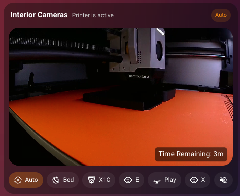

# Advanced Camera Card

[](https://github.com/hacs/integration)

A smart Home Assistant Lovelace card that automatically switches between camera feeds based on motion, door/window sensors, alarm state, time windows, or any entity state — with manual override controls and a linger delay to hold a feed after a trigger clears.

The card wraps `custom:webrtc-camera` by default, but the child card type can be overridden per camera.

---

## Features

- Automatic camera switching driven by entity state, numeric threshold, or time window
- Priority-ordered rules — cameras are evaluated top-to-bottom; entity-based conditions win over time-based ones at the same priority level
- Nested AND / OR condition groups for complex logic
- Configurable linger delay keeps a triggered camera on screen for N seconds after its condition clears
- Manual override with per-camera chip buttons
- Optional auto-reset back to Auto mode after a configurable timeout
- Mute / unmute button for the active feed
- Optional camera preloading so switching is instant
- Fine-grained visibility controls for every header element
- Per-camera overlays: display entity states, attributes, or Jinja2 templates as floating labels on the feed

---

## Requirements

- Home Assistant (any recent version)
- HACS (optional, recommended for installation)
- [`custom:webrtc-camera`](https://github.com/AlexxIT/WebRTC) if using the default child card type

---

## Installation

### HACS (recommended)

1. In Home Assistant, open **HACS**.
2. Open the three-dot menu → **Custom repositories**.
3. Add `https://github.com/petergCA/advanced-camera-card` and select category **Dashboard**.
4. Install **Advanced Camera Card** and reload the browser.

HACS registers the resource automatically:

```yaml
url: /hacsfiles/advanced-camera-card/advanced-camera-card.js
type: module
```

### Manual

Copy `advanced-camera-card.js` to `/config/www/advanced-camera-card.js`, then add the resource under **Settings → Dashboards → Resources**:

```yaml
url: /local/advanced-camera-card.js
type: module
```

---

## How the card works

The `cameras` object is a map of camera definitions, each with a unique key you choose (e.g. `front_door`, `garage`, `living_room`). The order of the keys determines switching priority — the first camera whose `show_when` conditions are met is displayed.

Cameras without `show_when` never auto-trigger. The `default_camera` (which should usually be defined last and have no `show_when`) is shown whenever no other rule matches.

Entity-based conditions (motion sensors, alarm state, door contacts, etc.) are evaluated before time-based conditions at every priority level, so a motion event will always override a time window at the same position in the list.

---

## Configuration reference

### Card-level options

| Option | Type | Default | Description |
|---|---|---|---|
| `title` | string | `"Cameras"` | Header title text. |
| `default_camera` | string | first key | Camera shown when no `show_when` rules match. Must be a key in `cameras`. |
| `auto_reset_minutes` | number | `0` | Minutes before a manual override reverts to Auto. `0` disables the timer. |
| `default_linger_seconds` | number | `0` | Seconds any triggered camera stays on screen after its condition clears. Applied to cameras without their own `linger_seconds`. |
| `preload_cameras` | boolean | `false` | Load all camera cards at startup so switching is instant. Uses more memory. |
| `card_height` | number | — | Fix the camera area to this pixel height. Useful when cameras have different aspect ratios. |
| `compact` | boolean | `false` | Slightly reduced padding and grid height. |
| `webrtc_defaults` | object | see below | Default options passed to the child card for every camera. |
| `cameras` | object | **required** | Camera definitions, keyed by a unique string ID. |

### Visibility options

| Option | Type | Default | Description |
|---|---|---|---|
| `show_header` | boolean | `true` | Show/hide the entire header row. |
| `show_title` | boolean | `true` | Show/hide the title text. |
| `show_reason` | boolean | `true` | Show/hide the reason text beside the title. |
| `show_mode_pill` | boolean | `true` | Show/hide the Auto / Manual pill. |
| `show_controls` | boolean | `true` | Show/hide the chip bar and mute button. |

### `webrtc_defaults`

Default values applied to every camera's child card unless overridden at the camera level.

```yaml
webrtc_defaults:
  muted: true         # also sets the initial mute button state
  mode: webrtc
  ui: false
  style: ".mode {display: none}"
```

### Camera options

| Option | Type | Description |
|---|---|---|
| `name` | string | Friendly name shown on the chip button. |
| `icon` | string | MDI icon for the chip (e.g. `mdi:cctv`, `mdi:doorbell`, `mdi:garage`). |
| `entity` | string | Camera entity ID (e.g. `camera.front_door`). |
| `show_when` | list | Conditions that trigger this camera. See Conditions below. |
| `operator` | string | How the `show_when` list is combined: `and` (default) or `or`. |
| `reason` | string | Status text shown in the header when this camera is active. |
| `linger_seconds` | number | Seconds to hold this camera after its condition clears. Overrides `default_linger_seconds`. |
| `linger_reason` | string | Status text shown during the linger period. Falls back to `reason`. |
| `card_type` | string | Child card type. Defaults to `custom:webrtc-camera`. |
| `mode` | string | WebRTC stream mode for this camera. Overrides `webrtc_defaults.mode`. |
| `ui` | boolean | Show the WebRTC UI overlay. Overrides `webrtc_defaults.ui`. |
| `style` | string | CSS injected into the child card. Overrides `webrtc_defaults.style`. |
| `card_options` | object | Additional options merged into the child card config. Takes highest precedence. |
| `overlays` | list | Floating labels rendered on top of the camera feed. See [Overlays](#overlays) below. |

---

## Overlays

Each camera can have an `overlays` list — floating labels rendered on top of the feed at arbitrary positions. Useful for showing temperature, door state, occupancy counts, or any other entity value directly on the video.

### Overlay options

| Option | Type | Default | Description |
|---|---|---|---|
| `entity` | string | — | Home Assistant entity ID whose state is displayed. |
| `attribute` | string | — | Read this attribute instead of `state`. Falls back to `state` if the attribute is missing. |
| `name` | string | — | Optional label prefix shown before the value. |
| `template` | string | — | Jinja2 template or simple `{{ }}` expression. Takes precedence over `entity`. |
| `x` | number | `50` | Horizontal position as a percentage of the camera area (0 = left edge, 100 = right edge). |
| `y` | number | `50` | Vertical position as a percentage of the camera area (0 = top edge, 100 = bottom edge). |
| `size` | number | `14` | Font size in pixels applied to the whole label. |
| `display` | string | `"name_state"` / `"state"` | Controls what is shown: `state` (value only), `name` (label only), or `name_state` (label + value). Defaults to `name_state` when `name` is set, otherwise `state`. |
| `name_size` | number | — | Override font size for the label part only. |
| `state_size` | number | — | Override font size for the value part only. |
| `format` | string | — | Format the value before display. `duration_minutes` treats the value as minutes; `duration_seconds` treats it as seconds. Both render as `1h 30m` style strings. |

### Positioning

`x` and `y` are percentages relative to the camera area. The label is centred on the given point. Use `x: 5, y: 5` for top-left, `x: 95, y: 95` for bottom-right, and so on.

### Template support

Simple `{{ }}` expressions are resolved locally without a server round-trip:

```yaml
template: "{{ states('sensor.front_door_temp') }}°C"
template: "{{ state_attr('climate.living_room', 'current_temperature') }}°"
```

Full Jinja2 templates (containing `{%` blocks or complex filters) are sent to Home Assistant via a WebSocket subscription and update automatically:

```yaml
template: "OpenClosed"
```

### Example



*An overlay displaying print time remaining on a Bambu Lab printer camera. The card is in Auto mode, triggered by a printer-active sensor.*

### More examples

**Single entity value:**

```yaml
cameras:
  driveway:
    name: Driveway
    entity: camera.driveway
    overlays:
      - entity: sensor.driveway_temperature
        name: Temp
        x: 5
        y: 90
        size: 13
```

**Multiple overlays — temperature and occupancy count:**

```yaml
cameras:
  backyard:
    name: Backyard
    entity: camera.backyard
    overlays:
      - entity: sensor.backyard_temperature
        name: "Temp:"
        x: 5
        y: 90
        size: 12
      - entity: sensor.backyard_person_count
        name: "People:"
        x: 5
        y: 80
        size: 12
```

**Attribute value — show a thermostat's set-point:**

```yaml
overlays:
  - entity: climate.living_room
    attribute: temperature
    name: "Set:"
    x: 10
    y: 10
    size: 13
```

**Duration format — show time since last motion as h/m:**

```yaml
overlays:
  - entity: sensor.front_door_last_motion_seconds
    format: duration_seconds
    name: "Last motion:"
    x: 5
    y: 92
    size: 12
```

**Conditional label via Jinja2 template:**

```yaml
overlays:
  - template: "OPENCLOSED"
    name: "Garage:"
    x: 50
    y: 5
    size: 14
```

**Value only (no name prefix):**

```yaml
overlays:
  - entity: sensor.driveway_vehicle_count
    display: state
    x: 95
    y: 5
    size: 16
```

---

## Conditions

Each entry in `show_when` is a condition object. The camera displays when the result of evaluating all conditions (using `operator`) is true.

### Entity equals state

```yaml
show_when:
  - entity: binary_sensor.front_door_motion
    state: "on"
```

`state` also accepts a list — the condition is true if the entity is in any of the listed values:

```yaml
show_when:
  - entity: alarm_control_panel.home
    state:
      - armed_home
      - armed_away
      - armed_night
```

### Entity not in state

```yaml
show_when:
  - entity: sensor.camera_status
    not_state:
      - idle
      - offline
      - unavailable
      - unknown
```

### Numeric threshold

```yaml
show_when:
  - entity: sensor.driveway_vehicle_count
    above: 0
```

`above` and `below` can be combined for a range. Both are exclusive (`>` / `<`):

```yaml
show_when:
  - entity: sensor.parking_spaces_occupied
    above: 0
    below: 10
```

### Time window

```yaml
show_when:
  - type: time
    after: "22:00"
    before: "06:00"
```

Ranges that cross midnight are supported (as in the example above).

### Multiple conditions on one camera

Use `operator` at the camera level to control how the conditions in `show_when` combine.

**OR — trigger when any condition is true:**

```yaml
cameras:
  front_door:
    name: Front Door
    entity: camera.front_door
    operator: or
    show_when:
      - entity: binary_sensor.doorbell_button
        state: "on"
      - entity: binary_sensor.front_door_motion
        state: "on"
      - entity: binary_sensor.front_door_person
        state: "on"
```

**AND — trigger only when all conditions are true:**

```yaml
cameras:
  garage:
    name: Garage
    entity: camera.garage
    operator: and
    show_when:
      - entity: binary_sensor.garage_door
        state: "on"            # door open
      - entity: input_boolean.away_mode
        state: "on"            # and we're away
```

### Nested condition groups

A `show_when` entry can itself be a group with its own `operator` and `conditions` list, allowing you to mix AND and OR logic.

```yaml
cameras:
  backyard:
    name: Backyard
    entity: camera.backyard
    operator: and
    show_when:
      - entity: alarm_control_panel.home
        state:
          - armed_away
          - armed_night
      - operator: or
        conditions:
          - entity: binary_sensor.backyard_motion
            state: "on"
          - entity: binary_sensor.backyard_person
            state: "on"
```

The above reads: "show backyard only when the alarm is armed AND (motion OR a person is detected)." Nesting works to any depth.

---

## Linger delay

By default a camera switches away the moment its `show_when` condition clears. `linger_seconds` holds the feed for that many seconds before reverting. If the condition becomes true again before the delay expires the countdown resets and the camera stays live.

```yaml
cameras:
  driveway:
    name: Driveway
    entity: camera.driveway
    linger_seconds: 45
    reason: Vehicle in driveway
    linger_reason: Driveway — clearing
    show_when:
      - entity: binary_sensor.driveway_motion
        state: "on"
```

Apply a global default with `default_linger_seconds` at the card level, then override per camera with `linger_seconds`. Setting `linger_seconds: 0` on a camera disables lingering for that camera even if a default is set.

---

## Examples

The examples below are designed as real-world starting points. Entity IDs follow common Home Assistant naming conventions — replace them with your actual entity IDs. Camera keys (e.g. `front_door`, `driveway`) are arbitrary strings; choose names that make sense for your setup.

To find your entity IDs in Home Assistant: go to **Settings → Devices & Services → Entities** and search by device or integration name. Camera entities start with `camera.`, motion sensors with `binary_sensor.`, and so on.

---

### 1 — Minimal: single camera, no switching

```yaml
type: custom:advanced-camera-card
title: Living Room
default_camera: living_room
cameras:
  living_room:
    name: Living Room
    icon: mdi:sofa
    entity: camera.living_room
```

---

### 2 — Front door focus

Stays on a wide overview camera. Switches to the doorbell camera on a ring, motion, or person detection, then holds the feed for 30 seconds after the trigger clears.

```yaml
type: custom:advanced-camera-card
title: Front of House
default_camera: overview
default_linger_seconds: 30
cameras:
  front_door:
    name: Front Door
    icon: mdi:doorbell
    entity: camera.front_door
    reason: Activity at front door
    linger_reason: Front door — holding
    operator: or
    show_when:
      - entity: binary_sensor.doorbell_button
        state: "on"
      - entity: binary_sensor.front_door_motion
        state: "on"
      - entity: binary_sensor.front_door_person
        state: "on"

  overview:
    name: Overview
    icon: mdi:home
    entity: camera.driveway_wide
```

---

### 3 — Multi-camera home security

Covers four zones. Switches to whichever zone has activity. Falls back to the living room (main view) when nothing is happening. Manual override resets after 15 minutes.

```yaml
type: custom:advanced-camera-card
title: Security
default_camera: living_room
auto_reset_minutes: 15
default_linger_seconds: 20
cameras:
  front_door:
    name: Front Door
    icon: mdi:doorbell
    entity: camera.front_door
    reason: Front door activity
    operator: or
    show_when:
      - entity: binary_sensor.doorbell_button
        state: "on"
      - entity: binary_sensor.front_door_motion
        state: "on"
      - entity: binary_sensor.front_door_person
        state: "on"

  driveway:
    name: Driveway
    icon: mdi:car
    entity: camera.driveway
    reason: Driveway motion
    show_when:
      - entity: binary_sensor.driveway_motion
        state: "on"

  backyard:
    name: Backyard
    icon: mdi:tree
    entity: camera.backyard
    reason: Backyard motion
    show_when:
      - entity: binary_sensor.backyard_motion
        state: "on"

  garage:
    name: Garage
    icon: mdi:garage
    entity: camera.garage
    reason: Garage door open
    show_when:
      - entity: binary_sensor.garage_door_contact
        state: "on"           # "on" = open for most door contact sensors

  living_room:
    name: Inside
    icon: mdi:sofa
    entity: camera.living_room
```

---

### 4 — Alarm-aware security

Only switches cameras automatically when the alarm is armed. While disarmed the default indoor camera is always shown. Nested OR handles multiple trigger sources per zone.

```yaml
type: custom:advanced-camera-card
title: Alarm Cameras
default_camera: indoor
auto_reset_minutes: 10
default_linger_seconds: 30
cameras:
  front_door:
    name: Front Door
    icon: mdi:doorbell
    entity: camera.front_door
    reason: Front door alert
    operator: and
    show_when:
      - entity: alarm_control_panel.home_alarm
        state:
          - armed_home
          - armed_away
          - armed_night
      - operator: or
        conditions:
          - entity: binary_sensor.front_door_motion
            state: "on"
          - entity: binary_sensor.front_door_person
            state: "on"
          - entity: binary_sensor.doorbell_button
            state: "on"

  backyard:
    name: Backyard
    icon: mdi:tree
    entity: camera.backyard
    reason: Backyard alert
    operator: and
    show_when:
      - entity: alarm_control_panel.home_alarm
        state:
          - armed_away
          - armed_night
      - entity: binary_sensor.backyard_motion
        state: "on"

  garage:
    name: Garage
    icon: mdi:garage
    entity: camera.garage
    reason: Garage opened while armed
    operator: and
    show_when:
      - entity: alarm_control_panel.home_alarm
        state:
          - armed_away
          - armed_night
      - entity: binary_sensor.garage_door_contact
        state: "on"

  indoor:
    name: Indoor
    icon: mdi:sofa
    entity: camera.living_room
```

---

### 5 — Night mode with infrared camera

Switches to an infrared or night-vision camera between sunset hours. Combine with motion for active monitoring only at night.

```yaml
type: custom:advanced-camera-card
title: Night Watch
default_camera: day_cam
cameras:
  night_motion:
    name: Night Motion
    icon: mdi:weather-night
    entity: camera.infrared_backyard
    reason: Night motion detected
    linger_seconds: 60
    operator: and
    show_when:
      - type: time
        after: "22:00"
        before: "05:30"
      - entity: binary_sensor.backyard_motion
        state: "on"

  night_idle:
    name: Night View
    icon: mdi:moon-waning-crescent
    entity: camera.infrared_backyard
    reason: Night-time view
    show_when:
      - type: time
        after: "22:00"
        before: "05:30"

  day_cam:
    name: Day View
    icon: mdi:white-balance-sunny
    entity: camera.backyard
```

The `night_motion` camera is evaluated first, so active motion at night takes priority over the time-only rule below it.

---

### 6 — Package and visitor detection

Uses a person detection sensor and a separate package/object sensor. Differentiates between a visitor (person) and a delivery (package detected, no person).

```yaml
type: custom:advanced-camera-card
title: Front Door
default_camera: overview
default_linger_seconds: 45
cameras:
  visitor:
    name: Visitor
    icon: mdi:account
    entity: camera.front_door_close
    reason: Person at door
    linger_reason: Visitor left — holding feed
    operator: or
    show_when:
      - entity: binary_sensor.front_door_person
        state: "on"
      - entity: binary_sensor.doorbell_button
        state: "on"

  delivery:
    name: Delivery
    icon: mdi:package-variant
    entity: camera.front_door_wide
    reason: Package detected
    linger_seconds: 120
    linger_reason: Package left at door — monitoring
    operator: and
    show_when:
      - entity: binary_sensor.front_door_package
        state: "on"
      - entity: binary_sensor.front_door_person
        state: "off"         # delivery person has left

  overview:
    name: Overview
    icon: mdi:home
    entity: camera.driveway_wide
```

---

### 7 — Business hours monitoring

Shows a customer-facing camera during business hours, then switches to a general interior view outside those hours. Staff can override manually at any time.

```yaml
type: custom:advanced-camera-card
title: Shop Cameras
default_camera: stockroom
auto_reset_minutes: 30
cameras:
  checkout:
    name: Checkout
    icon: mdi:cash-register
    entity: camera.checkout_area
    reason: Business hours — checkout active
    show_when:
      - type: time
        after: "09:00"
        before: "18:00"

  entrance:
    name: Entrance
    icon: mdi:store
    entity: camera.shop_entrance
    reason: Business hours — entrance
    show_when:
      - type: time
        after: "08:30"
        before: "18:30"

  stockroom:
    name: Stockroom
    icon: mdi:warehouse
    entity: camera.stockroom
```

---

### 8 — Complex multi-zone with zone-specific linger

Full outdoor coverage. Each zone has its own linger tuned to how quickly its motion sensor resets. The driveway lingers longest because vehicle sensors often clear fast.

```yaml
type: custom:advanced-camera-card
title: Outdoor Cameras
default_camera: front_overview
auto_reset_minutes: 20
cameras:
  front_door:
    name: Front Door
    icon: mdi:doorbell
    entity: camera.front_door
    reason: Front door activity
    linger_seconds: 30
    linger_reason: Front door — clearing
    operator: or
    show_when:
      - entity: binary_sensor.doorbell_button
        state: "on"
      - entity: binary_sensor.front_door_person
        state: "on"
      - entity: binary_sensor.front_door_motion
        state: "on"

  driveway:
    name: Driveway
    icon: mdi:car
    entity: camera.driveway
    reason: Vehicle detected
    linger_seconds: 60
    linger_reason: Driveway — vehicle clearing
    operator: or
    show_when:
      - entity: binary_sensor.driveway_motion
        state: "on"
      - entity: sensor.driveway_vehicle_count
        above: 0

  side_gate:
    name: Side Gate
    icon: mdi:gate
    entity: camera.side_gate
    reason: Side gate opened
    linger_seconds: 20
    show_when:
      - entity: binary_sensor.side_gate_contact
        state: "on"

  backyard:
    name: Backyard
    icon: mdi:tree
    entity: camera.backyard
    reason: Backyard motion
    linger_seconds: 15
    show_when:
      - entity: binary_sensor.backyard_motion
        state: "on"

  front_overview:
    name: Overview
    icon: mdi:home
    entity: camera.front_wide
```

---

### 9 — Mixed card types

Most cameras use WebRTC, but one uses a standard HA picture glance card. Use `card_type` and `card_options` to override on a per-camera basis.

```yaml
type: custom:advanced-camera-card
title: All Cameras
default_camera: hallway
webrtc_defaults:
  muted: true
  mode: webrtc
cameras:
  front_door:
    name: Front Door
    icon: mdi:doorbell
    entity: camera.front_door
    show_when:
      - entity: binary_sensor.front_door_motion
        state: "on"

  baby_room:
    name: Baby Room
    icon: mdi:baby
    entity: camera.baby_room
    card_type: custom:webrtc-camera
    mode: mse                          # use MSE for a low-latency indoor camera
    card_options:
      muted: false
    show_when:
      - type: time
        after: "19:30"
        before: "07:00"

  hallway:
    name: Hallway
    icon: mdi:walk
    entity: camera.hallway
```

---

### 10 — Compact embed with no controls

A space-saving embed for a smaller dashboard panel — header and controls hidden, fixed height.

```yaml
type: custom:advanced-camera-card
default_camera: driveway
show_header: false
show_controls: false
card_height: 220
cameras:
  front_door:
    name: Front Door
    entity: camera.front_door
    show_when:
      - entity: binary_sensor.front_door_motion
        state: "on"
  driveway:
    name: Driveway
    entity: camera.driveway
```

---

## Common entity patterns

This table is a quick reference for the entity types most often used in `show_when` conditions and their typical states. Use **Settings → Devices & Services → Entities** in Home Assistant to find your exact entity IDs and verify their current state.

| Entity type | Common entity ID pattern | Trigger state |
|---|---|---|
| Motion sensor | `binary_sensor.<location>_motion` | `"on"` |
| Person detected | `binary_sensor.<location>_person` | `"on"` |
| Door / window contact | `binary_sensor.<location>_contact` | `"on"` (open) |
| Doorbell button | `binary_sensor.<name>_doorbell` | `"on"` |
| Garage door | `binary_sensor.garage_door` or `cover.garage_door` | `"on"` / `"open"` |
| Alarm panel | `alarm_control_panel.<name>` | `armed_home`, `armed_away`, `armed_night` |
| Input boolean | `input_boolean.<name>` | `"on"` |
| Input select | `input_select.<name>` | any configured option value |
| Vehicle / object count | `sensor.<location>_vehicle_count` | `above: 0` |
| Package sensor | `binary_sensor.<location>_package` | `"on"` |

Binary sensors integrated via Frigate, Reolink, Amcrest, Eufy, Ring, Arlo, and similar integrations generally follow the `binary_sensor.<camera_name>_<event_type>` naming convention.

---

## Tips for building cards from your entity list

When configuring this card from scratch, work through these steps:

1. **List your camera entities.** Every camera needs an entry in the `cameras` object. The key is up to you; the `entity` value must be the exact Home Assistant entity ID.

2. **Identify your triggers.** For each camera, decide what should make it appear — motion, a door opening, the alarm arming, a time window, or a combination.

3. **Set priority order.** Put the most important / most specific cameras first. The first camera whose conditions are all met is shown. The default camera (no `show_when`) should usually be last.

4. **Choose `operator`.** If any one trigger is enough to show the camera, use `operator: or`. If all triggers must be true simultaneously, use `operator: and` (the default).

5. **Add linger if needed.** Motion sensors often clear within a few seconds. Use `linger_seconds` so the camera stays on screen long enough to be useful. 15–60 seconds is a common range.

6. **Set `default_camera`** to the camera you want when nothing is happening — typically a wide-angle overview or an indoor camera.

7. **Set `auto_reset_minutes`** if you want manual overrides to expire automatically. Useful in shared dashboards.
